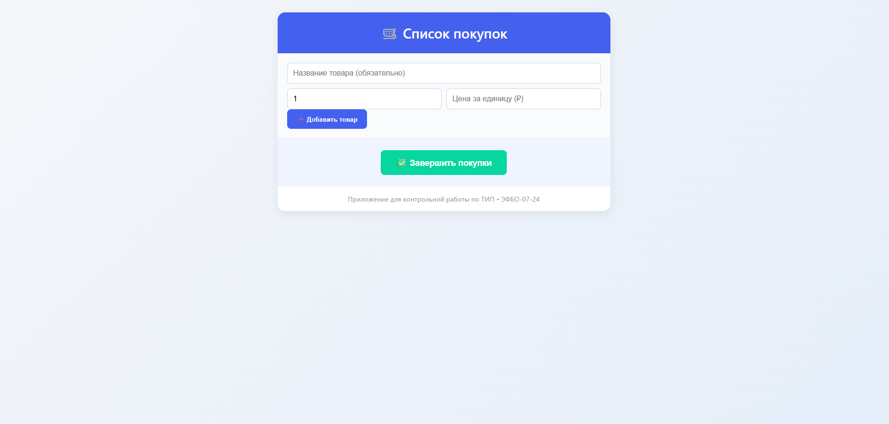
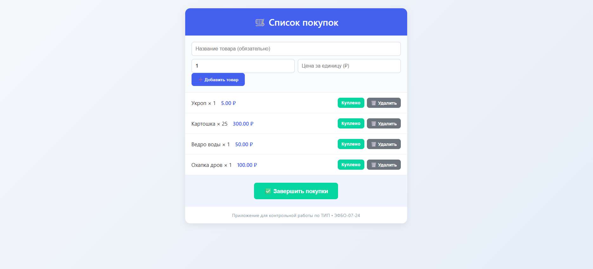
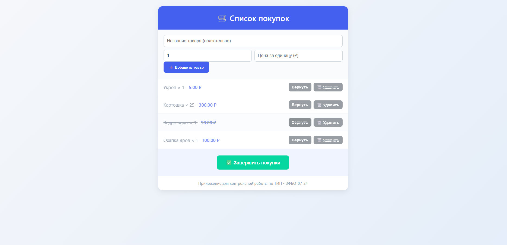
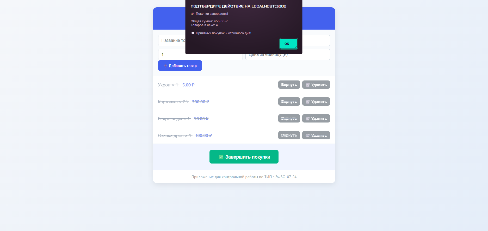
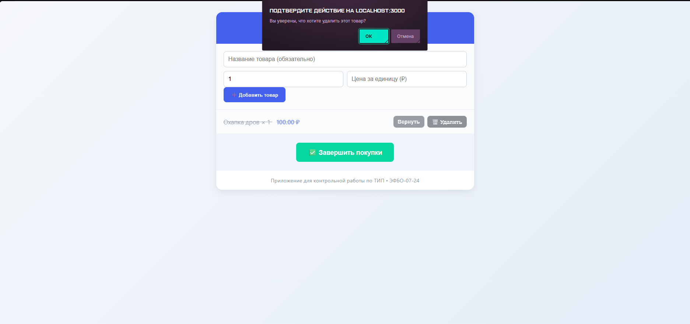

# 🛒 Список покупок

Контрольная работа №5 по дисциплине **Технологии индустриального программирования**  
Выполнил: Иващенко Алексей Александрович, гр. ЭФБО-07-24  
GitHub: [@ganeuxa](https://github.com/ganeuxa)

## 🔧 Функционал
- Добавление товаров (с названием и количеством)
- Пометка как «куплено» / «не куплено»
- Удаление товаров
- Фильтрация по статусу (`?purchased=true/false`)
- Простой веб-интерфейс


## 🖼️ Скриншоты

### Начальный экран



### Заполненая корзина покупок



### Все товары переведены в состояние 'куплено'



### Покупки завершены, произведён расчёт потраченных денег



### Удаление товаров из корзины




## 🚀 Запуск
```bash
npm install
npm start


